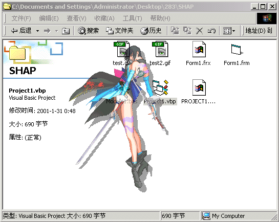



## Auto form shap

### Description

You just need to set a background picture for the form and specify a transparent color, and then the progrm will make up all for you. It will scan the picture, get rid of the transparent color pixels,generate rect region for every line and combine them. Finally the form will be set to exactly the same shap as the picture outline. Don't worry abuot the speed, it's always less than 1sec (but don't tell me you are running win95 on 486 ^_^). 

Note it only support 8bits bitmap now, if you want to extend the program's ability, please reference the MSDN for discuss about pixel format. There are also some win2k api declaration included for making translucent form, just remove the relevant code if you don't need the effect or dont't have a win2k. 

----

 

Hello man, i have updated this program to support every pixel formats, taking the advantage of the windows DIB. Special thanks www.vbaccelerator.com for their great class - "cDIBSection.cls".
 
### More Info
 

             |
---                |---
**Submitted On**   |2001-04-27 16:01:26
**By**             |[WXJ\_Lake](https://github.com/Planet-Source-Code/PSCIndex/blob/master/ByAuthor/wxj-lake.md)
**Level**          |Advanced
**User Rating**    |4.9 (138 globes from 28 users)
**Compatibility**  |VB 4\.0 \(32\-bit\), VB 5\.0, VB 6\.0
**Category**       |[Graphics](https://github.com/Planet-Source-Code/PSCIndex/blob/master/ByCategory/graphics__1-46.md)
**World**          |[Visual Basic](https://github.com/Planet-Source-Code/PSCIndex/blob/master/ByWorld/visual-basic.md)
**Archive File**   |[Auto form 189164282001\.zip](https://github.com/Planet-Source-Code/wxj-lake-auto-form-shap__1-22553/archive/master.zip)

